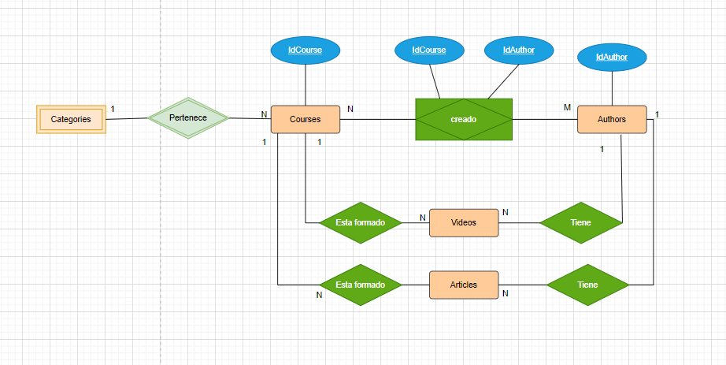

# Laboratorio de Modelado Relacional obligatorio

## Diagrama de chen

## Diagrama físico

## Explicación y patrones

### Modelado
He partido de la entidad Courses, que es la entidad principal de la base de datos. Apartir de esta he ido definiendo el resto de entiedades y las relaciones entre ellas.

### Entidades
- Courses
- Videos
- Authors
- Articles

### Relaciones
- Courses-videos: Es una relación de 1 a muchos. Un curso está formado por muchos videos, un video pertenece a un solo curso.
- Courses-articles: Es una relación de 1 a muchos. Un curso está formado por muchos videos, un video pertenece a un solo curso.
- courses-authors: Se trata de uuna relación N-M. Un curso puede estar creado por muchos autores, un autor puede crear muchos cursos.
- Courses-categories: Se trata de una relación 1-M. La entidad category puede aparecer en muchos cursos, sin embargo un curso solo puede pertenecer a una categoría.
- Authors-videos: Es una relación de 1-M. Un autor puede crear muchos videos. Un video solo puede pertenecer a un autor.
- Author-article: Es una relación de 1-M. Un autor puede crear muchos artículos. Un artículo solo puede pertenecer a un autor